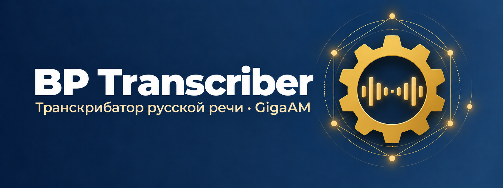
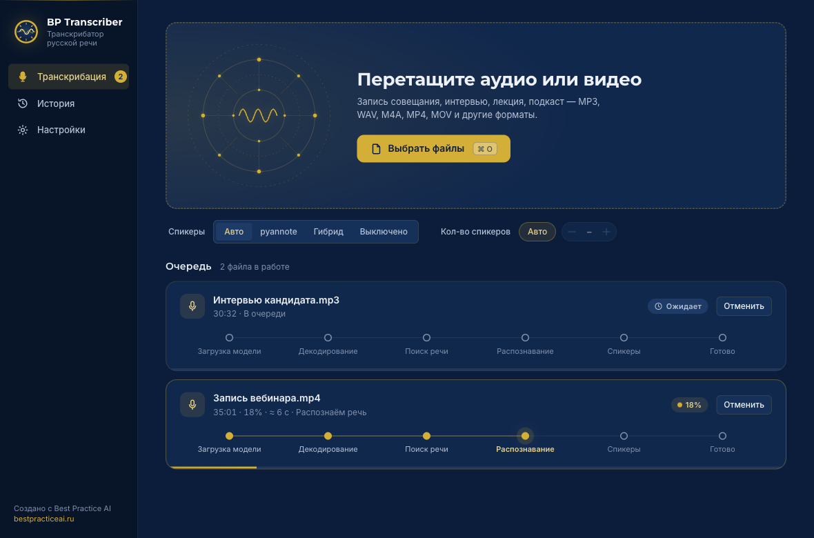
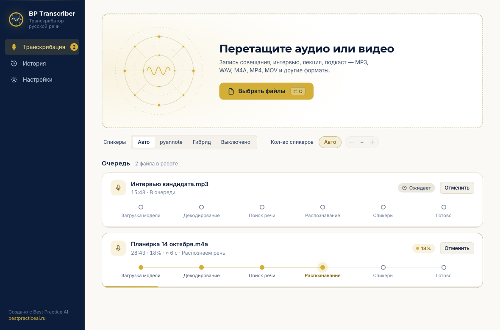
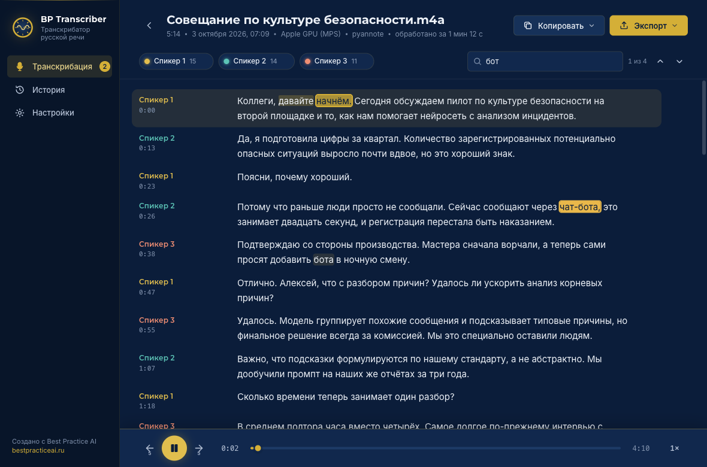
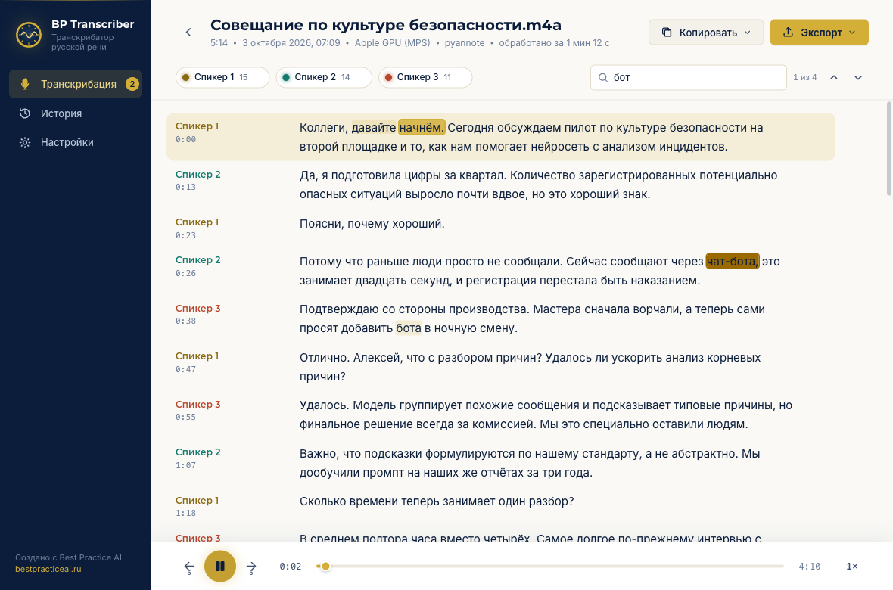
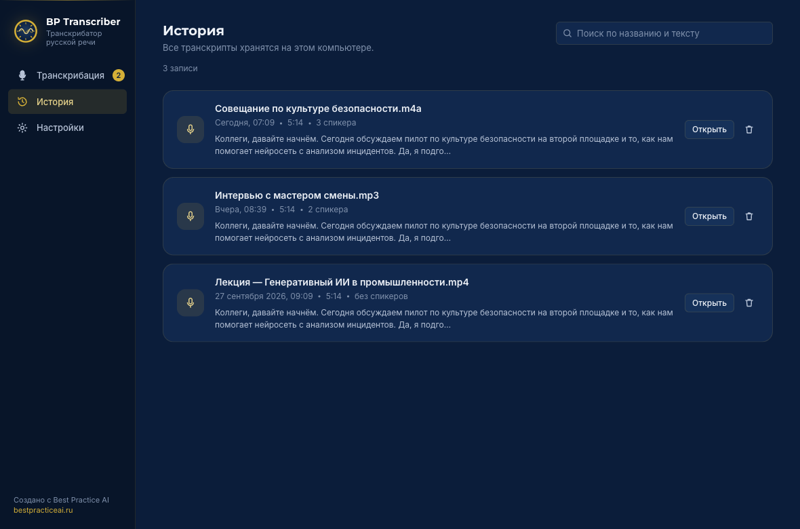
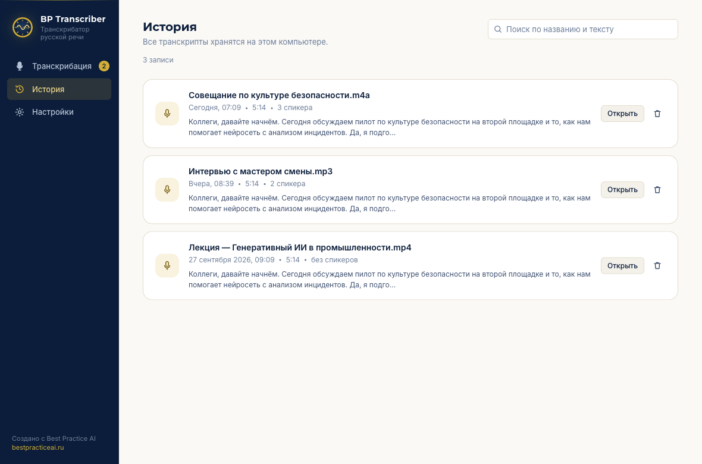
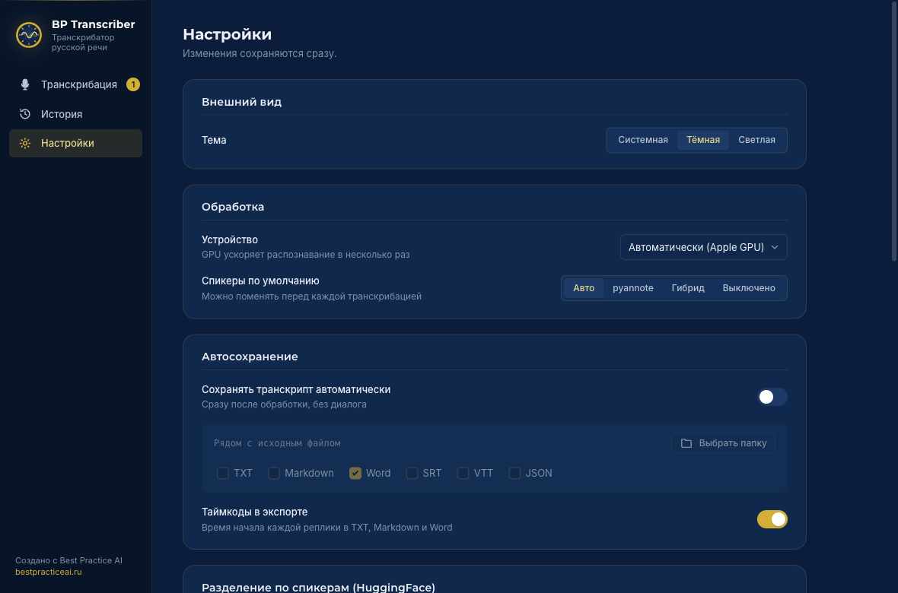
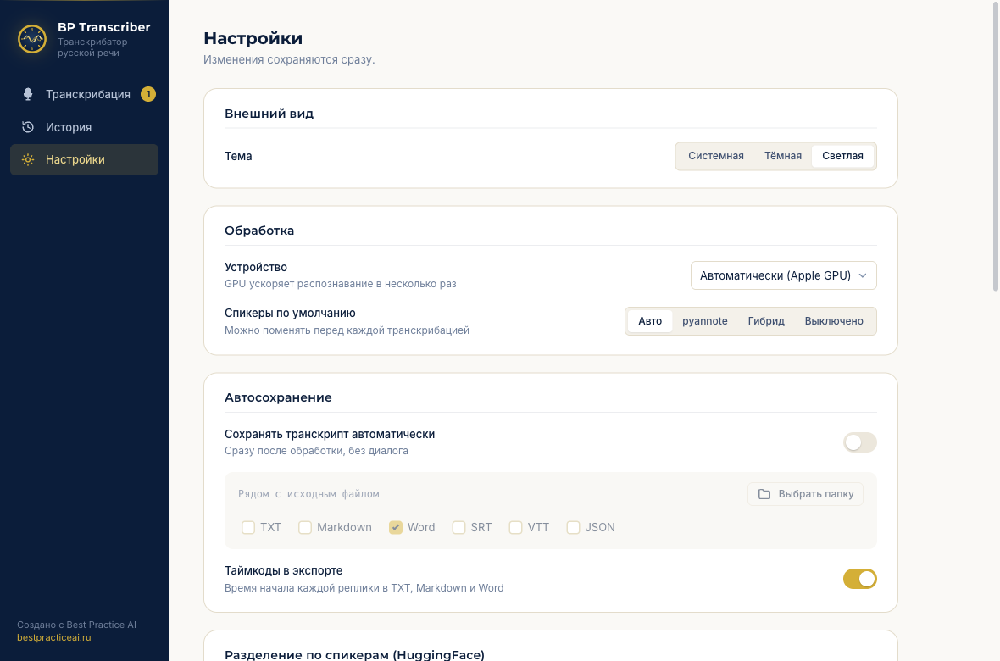

<p align="center">
  
</p>

<h1 align="center">BP Transcriber</h1>

<p align="center">
  Бесплатное настольное приложение для расшифровки русской речи в текст с разделением по спикерам.<br>
  Работает на вашем компьютере: файлы никуда не отправляются.
</p>

<p align="center">
  <a href="https://github.com/Isalin84/bp-transcriber/releases/latest"></a>
  <a href="LICENSE"></a>
  
</p>

BP Transcriber превращает записи встреч, интервью и звонков в текст с пунктуацией и таймкодами. Внутри распознавание речи [GigaAM](https://github.com/salute-developers/GigaAM) v3 от SaluteDevices и необязательное разделение по спикерам на базе [pyannote](https://github.com/pyannote/pyannote-audio).

## Возможности

- **GigaAM v3 с пунктуацией и нормализацией**: готовый текст с запятыми, точками и числами цифрами.
- **Офлайн**: файлы никуда не отправляются. Интернет нужен только один раз, чтобы скачать модели: GigaAM около 450 МБ, для разделения по спикерам ещё 25–30 МБ при первом использовании.
- **Разделение по спикерам**: режим pyannote (точный, нужен бесплатный токен Hugging Face) и гибридный режим без токена.
- **Таймкоды по словам**: у каждого слова есть время начала и конца.
- **Редактор с проигрывателем**: нажмите на время реплики, чтобы услышать это место; текущее слово подсвечивается при воспроизведении, текст правится двойным щелчком, спикеров можно переименовать.
- **Экспорт**: TXT, Markdown, DOCX, SRT, VTT, JSON.
- **История и очередь**: можно добавить сразу много файлов; готовые расшифровки сохраняются и доступны позже.
- **Любые форматы**: аудио и видео (MP3, M4A, WAV, FLAC, OGG, OPUS, MP4, MOV, MKV, WEBM и другие), FFmpeg уже внутри.
- **Ускорение на Apple GPU** (Metal) на Mac с чипами M1 и новее.
- **Бесплатно и с открытым кодом** (MIT).

## Скриншоты

<table>
  <tr>
    <td align="center"><b>Тёмная тема</b></td>
    <td align="center"><b>Светлая тема</b></td>
  </tr>
  <tr>
    <td></td>
    <td></td>
  </tr>
  <tr>
    <td></td>
    <td></td>
  </tr>
  <tr>
    <td></td>
    <td></td>
  </tr>
  <tr>
    <td></td>
    <td></td>
  </tr>
</table>

## Установка

Готовые установщики лежат на странице [Releases](https://github.com/Isalin84/bp-transcriber/releases/latest). Рядом с ними есть файл `SHA256SUMS.txt` для проверки загрузки.

Приложение пока не подписано сертификатами Apple и Microsoft (это платные программы для разработчиков), поэтому при первом запуске система покажет предупреждение. Это ожидаемо, ниже написано, что нажимать.

### macOS

1. Скачайте `BP-Transcriber-<версия>-macos-arm64.dmg`, откройте его и перетащите **BP Transcriber** в папку «Программы».
2. Первый запуск:
   - **macOS 12 до 14:** в «Программах» нажмите на приложение правой кнопкой (или Control и клик), выберите «Открыть», затем ещё раз «Открыть» в окне предупреждения.
   - **macOS 15 и новее:** запустите приложение; когда система откажет, откройте «Системные настройки → Конфиденциальность и безопасность», прокрутите вниз до сообщения о BP Transcriber и нажмите «Всё равно открыть». Подтвердите паролем.
3. Если приложение пишет, что «повреждено» или не открывается, снимите карантин командой в Терминале:

   ```bash
   xattr -dr com.apple.quarantine "/Applications/BP Transcriber.app"
   ```

Выбор запоминается: в следующий раз приложение откроется как обычное.

### Windows

1. Скачайте `BP-Transcriber-<версия>-windows-x64-setup.exe` и запустите его. Права администратора не нужны: по умолчанию приложение ставится в профиль пользователя (`%LOCALAPPDATA%\Programs\BP Transcriber`). Для установки на всех пользователей можно выбрать соответствующий вариант в начале мастера.
2. Windows SmartScreen может показать «Windows защитила ваш компьютер». Нажмите **Подробнее**, затем **Выполнить в любом случае**.
3. Для окна приложения нужен Microsoft Edge WebView2 Runtime. На Windows 11 и в обновлённых Windows 10 он уже есть, иначе установщик поставит его сам (загрузчик WebView2 уже вшит в установщик).
4. Запустите BP Transcriber из меню «Пуск».

**Удаление:** «Параметры → Приложения» (на Mac достаточно перетащить приложение в корзину). Ваши данные при этом не удаляются: настройки, история и модели остаются на диске (пути в разделе ниже). Если они больше не нужны, удалите эти папки вручную.

## Первый запуск

При первом запуске приложение предложит скачать модель GigaAM v3 (около 450 МБ). Загрузка идёт один раз, её можно прервать и продолжить позже. Дальше распознавание работает без интернета.

Где что хранится:

| Что | macOS | Windows |
|---|---|---|
| Модель GigaAM | `~/Library/Caches/BP Transcriber/gigaam` (или `~/.cache/gigaam`, если модель уже лежала там) | `%LOCALAPPDATA%\BestPractice\BP Transcriber\Cache\gigaam` |
| Модели pyannote (если включено разделение по спикерам) | `~/.cache/huggingface` | `%USERPROFILE%\.cache\huggingface` |
| Настройки и история | `~/Library/Application Support/BP Transcriber` | `%LOCALAPPDATA%\BestPractice\BP Transcriber` |
| Журналы (для сообщений об ошибках) | `~/Library/Logs/BP Transcriber` | `%LOCALAPPDATA%\BestPractice\BP Transcriber\Logs` |
| Токен Hugging Face | Связка ключей macOS | Диспетчер учётных данных Windows (если он недоступен — файл в папке настроек) |

Полностью очистить следы приложения на Windows можно так (PowerShell):

```powershell
Remove-Item -Recurse -Force "$env:LOCALAPPDATA\BestPractice\BP Transcriber"
```

## Разделение по спикерам

Режим pyannote определяет, кто и когда говорил, и подписывает реплики («Спикер 1», «Спикер 2»). Модели pyannote закрыты условиями использования на Hugging Face, поэтому для их скачивания нужен личный токен. Токен бесплатный и нужен один раз.

1. Создайте бесплатный аккаунт на [huggingface.co](https://huggingface.co/join).
2. Откройте [Settings → Access Tokens](https://huggingface.co/settings/tokens), создайте токен типа **Read** и скопируйте его.
3. Примите условия на двух страницах, нажав «Agree and access repository»:
   - [pyannote/speaker-diarization-community-1](https://huggingface.co/pyannote/speaker-diarization-community-1)
   - [pyannote/segmentation-3.0](https://huggingface.co/pyannote/segmentation-3.0)

Затем вставьте токен в «Настройки» приложения; там же есть кнопка проверки, она подскажет, на какой странице не приняты условия. Токен хранится в системном хранилище паролей и никуда, кроме Hugging Face, не отправляется.

**Без токена** доступен гибридный режим: детектор речи, голосовые эмбеддинги и кластеризация. Токен ему не нужен. При первом запуске он один раз скачает открытую модель голосовых эмбеддингов (около 26 МБ), дальше работает локально. Спикеров различает менее точно, чем pyannote.

## Системные требования

| | |
|---|---|
| macOS | 12 Monterey или новее, процессор Apple Silicon (M1 и новее); Intel Mac не поддерживается |
| Windows | 10 или 11, 64-разрядная; расчёты идут на процессоре |
| Память | 8 ГБ минимум, 16 ГБ рекомендуется (особенно для длинных записей и разделения по спикерам) |
| Диск | около 2 ГБ: приложение, модель GigaAM, модели pyannote |

## Для разработчиков

Нужен Python 3.12 и FFmpeg в `PATH`. Зависимости зафиксированы в lock-файлах; GigaAM ставится отдельно и без своих зависимостей (чтобы не тянуть onnx).

```bash
python3.12 -m venv .venv
source .venv/bin/activate             # Windows: .venv\Scripts\activate

# macOS (Apple Silicon)
pip install -r requirements/lock-macos-arm64.txt
# Windows (CPU-сборка PyTorch лежит на отдельном индексе)
# pip install -r requirements/lock-win-x64.txt --extra-index-url https://download.pytorch.org/whl/cpu

pip install --no-deps -r requirements/gigaam.txt
pip install --no-deps -e .
pip install pytest
```

Запуск:

```bash
python -m bp_transcriber            # приложение
python -m bp_transcriber --fake     # имитация распознавания, удобно для разработки интерфейса
python -m bp_transcriber --selftest # проверка зависимостей без окна
```

Тесты (быстрые, без модели и без окна):

```bash
python -m pytest -q -m "not slow"
```

Сборка установщиков (PyInstaller, DMG, Inno Setup) описана в [packaging/README.md](packaging/README.md). Сборку на GitHub Actions запускает тег `v*` (см. `.github/workflows/release.yml`): он собирает оба установщика и создаёт черновик релиза.

### Python API и CLI

Ядро доступно и без интерфейса, как библиотека и как консольные команды (`gigaam-transcribe`, `gigaam-batch`).

```python
from gigaam_transcriber import GigaAMTranscriber

with GigaAMTranscriber() as transcriber:       # model_name="v3_e2e_rnnt", device="auto"
    result = transcriber.transcribe(
        "meeting.mp4",
        diarization="pyannote",                # "none" | "pyannote" | "hybrid"
        num_speakers=3,                        # необязательно
    )

print(result.text)
for seg in result.segments:
    print(f"[{seg.start:.1f}-{seg.end:.1f}] {seg.speaker}: {seg.text}")

result.save("transcript.json", format="json")  # также txt, srt, vtt
result.save("subtitles.srt")
```

Токен для `pyannote` берётся из аргумента `hf_token` или переменной окружения `HF_TOKEN`.

```bash
gigaam-transcribe audio.wav                                    # простая расшифровка
gigaam-transcribe meeting.mp4 -d pyannote --speakers 3 -o meeting.txt
gigaam-transcribe interview.mp3 -d pyannote -f json -o interview.json
gigaam-transcribe video.mp4 -f srt -o subtitles.srt
gigaam-batch *.mp3 -o transcripts/ -d pyannote                 # пакетная обработка
```

Модели GigaAM: `v3_e2e_rnnt` (по умолчанию, с пунктуацией), `v3_e2e_ctc`, а также `v3_rnnt` и `v3_ctc` без пунктуации. Режимы разделения по спикерам: `none`, `pyannote`, `hybrid`. Форматы вывода: `txt`, `json`, `srt`, `vtt`.

Схема JSON:

```json
{
  "metadata": {"source": "meeting.mp4", "duration": 3600.5, "speakers_count": 3},
  "segments": [{"start": 0.0, "end": 17.41, "speaker": "Спикер №1", "text": "..."}],
  "full_text": "..."
}
```

## Лицензии и благодарности

BP Transcriber распространяется под лицензией [MIT](LICENSE). Он стоит на плечах чужих проектов:

- [GigaAM](https://github.com/salute-developers/GigaAM) от SaluteDevices (MIT): модель распознавания речи.
- [DialogScribe](https://github.com/yaruslove/DialogScribe) от yaruslove: исходная база ядра транскрибации, из которой вырос проект.
- [pyannote.audio](https://github.com/pyannote/pyannote-audio) (MIT) и модели `speaker-diarization-community-1` (CC-BY-4.0) и `segmentation-3.0` (MIT): разделение по спикерам.
- [Silero VAD](https://github.com/snakers4/silero-vad) (MIT): поиск речи в записи.
- [FFmpeg](https://ffmpeg.org) (LGPL-2.1+): сборка без GPL-компонентов; исходный код доступен на ffmpeg.org.
- PyTorch, SpeechBrain, pywebview, Bottle и другие: см. [NOTICE.md](NOTICE.md).
- Шрифты Montserrat и Inter распространяются по лицензии SIL OFL 1.1.

Полный список и тексты лицензий: [NOTICE.md](NOTICE.md).

## English summary

**BP Transcriber** is a free, open-source desktop app (macOS Apple Silicon, Windows 10/11 x64) for offline Russian speech-to-text. It runs [GigaAM](https://github.com/salute-developers/GigaAM) v3 with punctuation, optional speaker diarization (pyannote with a free Hugging Face token, or a token-free hybrid mode), word-level timing, an editor with synchronized playback, and export to TXT, MD, DOCX, SRT, VTT and JSON. Download installers from [Releases](https://github.com/Isalin84/bp-transcriber/releases/latest); the builds are unsigned, so macOS Gatekeeper and Windows SmartScreen will warn on first launch (see the installation steps above). The first launch downloads a ~450 MB model, after that no internet is needed. The core is also usable as a Python library and CLI (`gigaam-transcribe`); see the developer section. MIT licensed.

---

<p align="center">Создано с Best Practice AI · <a href="https://bestpracticeai.ru">bestpracticeai.ru</a></p>
